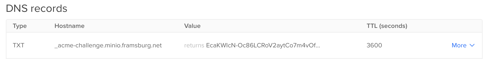

# Harware Setup of Raspberry PIs

https://www.blinkstick.com/products/blinkstick-nano

The initial setup is done with Ansible.

## Bootstrap new Raspberry Pi

* Download newest Raspberry Pi Imager
* Image Ubuntu Server
* (Req: MAC is configure in DHCP)
* Boot Up
* (Optional) If host was already configured: `sudo ssh-keygen -R <oldhost>` and `sudo ssh-keygen -R <ip>`
* Configure new host in ansible `hosts.yaml`
* Add system to the hosts file
* Ensure the default user exists in `group_vars/<distribution-name>.yaml`
  Otherwise add a file with the variable `ansible_user_first_run`
* Run ansible with `ansible-playbook add-user-ssh.yaml --limit <newhost>`


## PoE HAT

The fan of the PoE HAT tends to occelate between min and max speed. Accoding to
an [article by Jeff Geerling][3] this can be adjusted.

## PSU

https://github.com/dzomaya/NUTandRpi

## Install Longhorn Disks

https://www.ekervhen.xyz/posts/2021-02/troubleshooting-longhorn-and-dns-networking/


### New disk

find out device `lsblk -f`
on new devices `wipefs -a /dev/{{ var_disk }}`

```bash
$ sudo fdisk -l
$ sudo fdisk /dev/sdb

Command: g
Created a new GPT disklabel (GUID: xxxxx)

Command: n
Partition number: 1 (default)
First sector: (default)
Last sector: (default)
Command: w

$ sudo fdisk -l
```

Create Filesystem

```bash
$ sudo mkfs -t ext4 /dev/sdb1
```

Create mountpoint and fstab entry

```bash
$ sudo mkdir /var/lib/longhorn
$ sudo lsblk -o name,uuid
NAME UUID
sde1 9999-9999...

$ echo "UUID=0ec0cac5-6825-467b-acf7-da5505517b66 /var/lib/longhorn2 ext4 defaults 0 2" >> /etc/fstab
$ sudo mount /var/lib/longhorn2
```


## Setup Minio


TLS:
https://docs.ansible.com/ansible/latest/collections/community/crypto/acme_certificate_module.html

Install Minio with installer.

It is recommended to setup MinIO with a correct Domain and Certificate because,
several systems either do not support insecure connections, custom certificates
or disabling verification. The [MinIO Documentation][1] has a good guide how to
use `certbot` to install this. 

### Certs over certbot

You can use HTTP or DNS challenge. The latter is dicribed on [digitalocean][2]
```bash
$ certbot certonly --config-dir config --work-dir workdir --logs-dir logs  --manual  --preferred-challenges dns --debug-challenges -d minio.framsburg.net
```

During the execution, certbot requires you to add a specific DNS entry to your
Domain. This looks similar to:



### Certs over ACME Client (Opnsense)

Opnsense has a service plugin for the ACME protocol to create certificates. The
tricky part is how to get the certificates from Opnsense to Minio. The plugin
allows to create automations to do for example a SFTP copy of the certs to the
minio server.

The only small pitfall is that Minio users for the public cert not the pure cert
file put the full chain, which is a combination of the cert + ca as described
in the [MinIO Documentation][4].

So your Opnsense Config looks something like this:

| Field                  | Value                            |
|------------------------|----------------------------------|
| Name                   | Upload Minio Certificate         |
| Run Command            | Upload certificate via SFTP      |
| SFTP Host              | minio.server                     |
| SFTP Port              | 22                               |
| Removte Path           | /path-to-minio-home/.minio/certs |
| Naming "key.pem"       | private.key                      |
| Naming "fullchain.pem" | public.crt                       |


## Setup Minio Monitoring

Minio requires two env variables to connect to prometheus metrics:

```bash
export MINIO_PROMETHEUS_URL=https://prometheus.framsburg.ch
export MINIO_PROMETHEUS_JOB_ID=minio-job
```

Additionally you might need to set `MINIO_PROMETHEUS_AUTH_TYPE` to `public` as
authentication over jwt is the default.


## Setup Minio Bucket for Backup

```bash title="Create minio bucket"
$ mc mb myminio/k3s
$ mc mb myminio/k3s/etcd-snapshot
```

```bash title="Create user with policy"
$ mc admin user add myminio k3s k3sk3sk3s

$ cat > /tmp/etcd-backups-policy.json <<EOF
{
  "Version": "2012-10-17",
      "Statement": [
    {
      "Action": [
        "s3:PutBucketPolicy",
        "s3:GetBucketPolicy",
        "s3:DeleteBucketPolicy",
        "s3:ListAllMyBuckets",
        "s3:ListBucket"
      ],
      "Effect": "Allow",
      "Resource": [
        "arn:aws:s3:::k3s"
      ],
      "Sid": ""
    },
    {
      "Action": [
        "s3:AbortMultipartUpload",
        "s3:DeleteObject",
        "s3:GetObject",
        "s3:ListMultipartUploadParts",
        "s3:PutObject"
      ],
      "Effect": "Allow",
      "Resource": [
        "arn:aws:s3:::k3s/*"
      ],
      "Sid": ""
    }
  ]
}
EOF

$ mc admin policy add myminio etcd-backups-policy /tmp/etcd-backups-policy.json

$ mc admin policy set myminio etcd-backups-policy user=k3s
```


## Define K3S backup target

```Ansible title="k3s-server.services"
[Service]
ExecStart={{ k3s_binary_path }}/k3s server \
...

    --etcd-s3 \
    --etcd-snapshot-schedule-cron='{{ backup_schedule_cron }}' \
    --etcd-s3-endpoint='{{ backup_s3_endpoint }}' \
    --etcd-s3-endpoint-ca='{{ systemd_dir }}/k3s-server.service.crt' \
    --etcd-s3-bucket='{{ backup_s3_bucket }}' \
    --etcd-s3-folder='{{ backup_s3_folder }}' \
    --etcd-s3-access-key='{{ backup_s3_access_key }}' \
    --etcd-s3-secret-key='{{ backup_s3_secret_key }}' \

```

Define in ansible vault `ansible-vault edit group_vars/all.yaml` the four coordinates:
```properties title="vault"
backup_s3_access_key: k3s
backup_s3_secret_key: k3sk3sk3s
```

```properties title="hosts"
backup_schedule_cron: '0 */6 * * *'
backup_s3_bucket: k3s
backup_s3_folder: etcd-snapshot
backup_s3_endpoint_ca: |
          -----BEGIN CERTIFICATE-----
          MIIDgTCCAmmgAwIBAgIJAJ85e+K5ngFRMA0GCSqGSIb3DQEBCwUAMGsxCzAJBgNV
```


## (Optional) Rolling Update

The initial ansible script is not very suitable for rolling updates as it
assumes it is about to initialize a cluster which requires the order

1. First master node which initializes (or restores) the etcd state
2. All other master nodes which sync up to the first
3. All worker nodes

That is very efficient for setup and restore but would mean some outages if
applied on a live cluster. Therefore we need a playbook which goes through
every node sequentially (we have no special requirement on performance) and
cares about draining nodes correctly.

Ideally we can reuse roles from the cluster setup playbook.


## Update K3S Version

Update version in hosts or manifest

Use playbook `07_k3s_update` and start with the master nodes individually.
Be aware that Longhorn and other systems need time to recover from the reboots
otherwise they will block a shutdown or might loose data.

```bash
ansible-playbook playbooks/07_k3s_update.yml --limit k3smaster1
```


## Lenovo nic e1000

Some tiny servers might have an issue with their network card specifically with
the offloading. In case the network adapter hangs itself up the following
command might help:

```shell
ethtool -K <ADAPTER> gso off gro off tso off 
```

This should be added as startup command to `/etc/network/if-up.d/`


## Hardware Buy List

* https://www.mk1manufacturing.com/cart.php?m=view
* https://racknex.com/shop/lenovo/
* https://www.uctronics.com/raspberry-pi.html
* https://store.45homelab.com/configure/hl15
* https://www.serverschmiede.com/konfigurator_bulk/en/truenas
* https://www.serverschmiede.com/konfigurator_bulk/en/supermicro-cse-116ts-h12ssw-ntr-19-1u-10x-25-sff-nvme-sas-sata-amd-epyc-gen2-gen3-ddr4-ecc-raid-2x-psu
* https://serverando.de/Server/
* https://www.servethehome.com/introducing-project-tinyminimicro-home-lab-revolution/
* https://www.pchc.ch/en/Divers/spare-parts/Lenovo-CARDPOP-BLD-Tiny8-BTB-LAN-card----5C50W00908.html
* https://www.ebay.com/itm/276424564157
* 
* 


[1]: https://min.io/docs/minio/linux/integrations/generate-lets-encrypt-certificate-using-certbot-for-minio.html
[2]: https://www.digitalocean.com/community/tutorials/how-to-acquire-a-let-s-encrypt-certificate-using-dns-validation-with-acme-dns-certbot-on-ubuntu-18-04
[3]: https://www.jeffgeerling.com/blog/2021/taking-control-pi-poe-hats-overly-aggressive-fan
[4]: https://min.io/docs/minio/linux/integrations/generate-lets-encrypt-certificate-using-certbot-for-minio.html#step-4-set-up-ssl-on-minio-server-with-the-certificates
