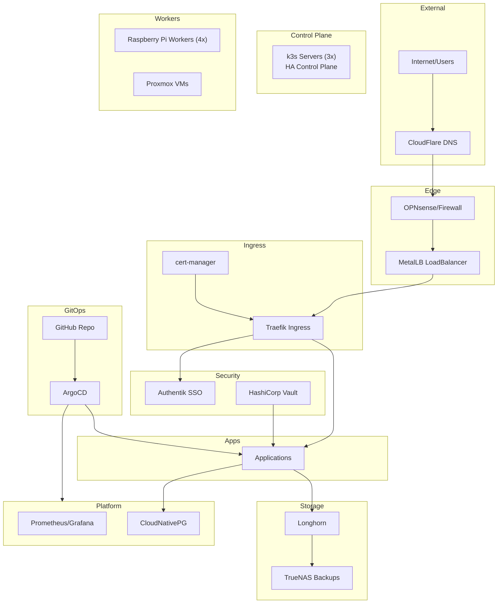
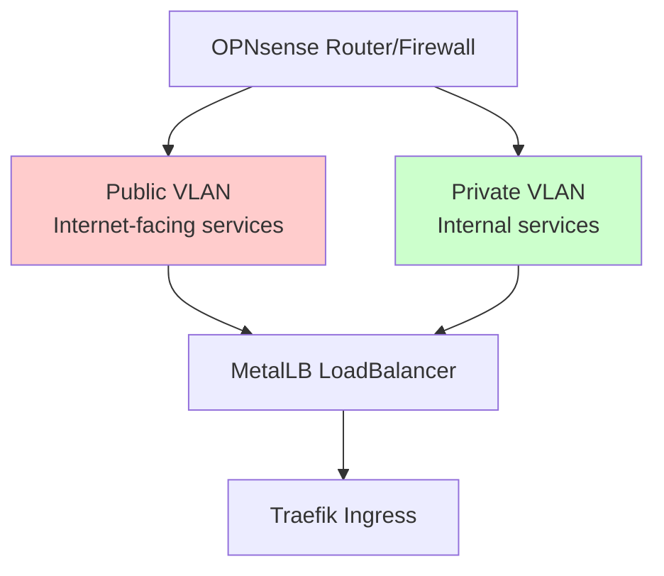
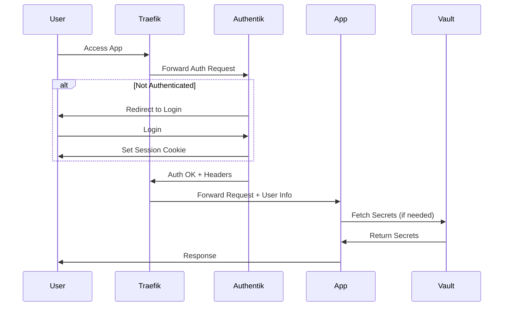
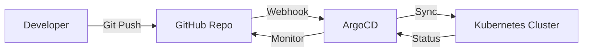

# Architecture

This document describes the overall architecture of the k3s homelab cluster, explaining the key design decisions and how components interact.

## High-Level Architecture



## Design Principles

### 1. Everything as Code (GitOps)

**Why**: Reproducibility, version control, and disaster recovery

- All cluster configuration is stored in Git
- ArgoCD continuously reconciles Git state with cluster state
- No manual `kubectl apply` commands in production
- Changes are reviewed via pull requests

### 2. Security by Default

**Why**: Protect services and data, practice production-ready security

- All external services require HTTPS with valid certificates
- SSO/OIDC authentication via Authentik for supported apps
- Secrets stored in HashiCorp Vault, never in Git
- Network segmentation (public/private VLANs)
- Regular security updates via Ansible automation

### 3. High Availability for Critical Components

**Why**: Minimize downtime, practice HA patterns

- 3-node control plane for k3s (etcd quorum)
- Longhorn replicates storage across nodes
- Multiple worker nodes for workload distribution
- TrueNAS for reliable backup storage

### 4. Observable and Debuggable

**Why**: Quickly identify and resolve issues

- Prometheus metrics from all components
- Grafana dashboards for visualization
- Loki for centralized logging
- Alerting for critical issues

## Network Architecture

### VLAN Segmentation



**Public VLAN**: Internet-facing services (limited)
**Private VLAN**: Internal services, more relaxed policies

### MetalLB Configuration

- **Mode**: Layer 2 (ARP)
- **IP Pools**: Separate ranges for public/private
- **Benefits**: Native LoadBalancer support on bare metal

### Traefik Ingress

Two separate Traefik instances:

1. **Traefik Public**: Handles external traffic
   - HTTPS with automatic certificate management
   - Rate limiting
   - Auth middleware (Authentik forward auth)

2. **Traefik Private**: Handles internal traffic
   - Access to admin dashboards
   - Internal APIs
   - Less restrictive policies

**Why Two?**: Separation of concerns, different security policies, easier debugging

## Storage Architecture

### Longhorn (Primary)

- **Type**: Distributed block storage
- **Replication**: 3 replicas for important data
- **Backend**: NVMe drives on worker nodes
- **Backup**: Automated backups to MinIO/TrueNAS
- **Use Cases**: Databases, application state, persistent volumes

### TrueNAS

- **Type**: External NAS with ZFS
- **Use Cases**: 
  - Backup target for Longhorn
  - NFS shares for large media files
  - Long-term archival storage

## Security Architecture

### Authentication Flow



### Secrets Management

**Three-Layer Approach**:

1. **Vault**: Central secrets storage
2. **External Secrets Operator**: Syncs secrets from Vault to k8s Secrets
3. **Secrets Store CSI**: Mounts secrets as files (for apps that need file-based secrets)

**Why Not Just k8s Secrets?**: 
- Vault provides audit logging
- Secret rotation
- Fine-grained access control
- External secret source (survives cluster rebuild)

## GitOps Workflow



### Repository Structure

```
k3s-cluster-infra-apps/
├── apps-root-config/          # ArgoCD ApplicationSets
│   └── applications/          # App of Apps pattern
├── cluster-init-apps/         # Bootstrap (MetalLB, cert-manager)
├── cluster-critical-apps/     # Core infra (Traefik, Longhorn, etc)
├── cluster-platform-apps/     # Platform services
└── cluster-*-apps/            # Application groups
```

### Deployment Layers

1. **Layer 0 (Manual)**: k3s cluster + ArgoCD installation
2. **Layer 1 (ArgoCD)**: cluster-init-apps (MetalLB, cert-manager)
3. **Layer 2 (ArgoCD)**: cluster-critical-apps (Traefik, Longhorn, Vault)
4. **Layer 3 (ArgoCD)**: cluster-platform-apps (Monitoring, databases)
5. **Layer 4 (ArgoCD)**: Applications

## Monitoring & Observability

### Metrics Stack

- **Prometheus**: Scrapes metrics from all components
- **Grafana**: Visualizes metrics with dashboards
- **AlertManager**: Routes alerts (future: to Slack/PagerDuty)

### Logging Stack

- **Loki**: Log aggregation
- **Promtail**: Log shipping agent on each node
- **Grafana**: Log viewing and querying

## Disaster Recovery Strategy

### Backup Targets

1. **Longhorn Volumes**: Automated backups to MinIO/TrueNAS
2. **Vault Data**: Encrypted backup to external storage
3. **ArgoCD Configuration**: In Git (inherently backed up)
4. **PostgreSQL Databases**: CNPG automated backups

### Recovery Scenarios

**Scenario 1: Single Node Failure**
- Workloads automatically reschedule to healthy nodes
- Storage remains available (Longhorn replication)
- **RTO**: Minutes to hours (automatic)

**Scenario 2: Complete Cluster Loss**
- Rebuild cluster with Ansible
- Deploy ArgoCD (manual)
- ArgoCD syncs all apps from Git
- Restore Longhorn volumes from backup
- Restore Vault from backup
- **RTO**: 4-8 hours

## Technology Choices Explained

### Why k3s Over k8s?

- Lightweight (runs well on Raspberry Pi)
- Single binary, easy to install
- Built-in components (though we replace some)
- Perfect for edge/homelab

### Why Traefik Over NGINX Ingress?

- Native Kubernetes CRDs (IngressRoute)
- Automatic service discovery
- Better middleware support
- Modern architecture

### Why Longhorn Over Rook/Ceph?

- Simpler to operate
- Lower resource overhead
- Great UI
- Sufficient for homelab scale

### Why ArgoCD Over Flux?

- Mature UI for visualization
- Easier to debug sync issues
- ApplicationSet pattern powerful
- Better RBAC for multi-user (future)

### Why CloudNativePG Over Zalando?

- Active development
- Better backup integration
- Simpler operator
- EDB backing (PostgreSQL core team)

## Hardware Configuration

### Control Plane (3 nodes)
- **Hardware**: Raspberry Pi 4 (8GB RAM)
- **Role**: k3s control plane + etcd
- **Storage**: USB boot only
- **HA**: 3-node quorum

### Worker Nodes (7 nodes)
- **4x Raspberry Pi 4** (8GB RAM) with external NVMe
- **3x Proxmox VMs** (varies, 64GB RAM hosts)
- **Role**: Application workloads + Longhorn storage

### External Storage
- **TrueNAS HL15**: 6x HDDs (~40TB)
- **Use**: Longhorn backups, large file storage

## Scaling Considerations

### Horizontal Scaling

**Worker Nodes**: 
- Easy to add new nodes via Ansible
- Longhorn automatically uses new storage
- Workloads distribute automatically

**Applications**: 
- Increase replica count in Helm values
- ArgoCD syncs changes
- HPA (Horizontal Pod Autoscaler) for automatic scaling

### Current Capacity

- **Control Plane**: 3 nodes (adequate for homelab scale)
- **Worker Nodes**: 7 nodes (can add more)
- **Storage**: ~2TB usable (Longhorn), 40TB (TrueNAS)
- **Can Support**: 100+ application pods comfortably

## Performance Characteristics

### Resource Usage (Cluster Overhead)

- **Control Plane**: ~2GB RAM per node
- **Longhorn**: ~200MB per node + storage overhead
- **Monitoring Stack**: ~2GB RAM
- **ArgoCD**: ~500MB RAM
- **Total Overhead**: ~6-8GB RAM

### Network Performance

- **Internal**: ~1Gbps (Raspberry Pi limitation)
- **External**: Limited by internet connection
- **Storage**: NVMe provides low latency (<10ms)

## Security Considerations

### Attack Surface

**External**:
- Only necessary services exposed via Traefik public
- All HTTPS with valid certificates
- Rate limiting on public ingress

**Internal**:
- Private VLAN for admin dashboards
- Authentik SSO for authentication
- RBAC for service accounts

### Secrets Handling

- Never committed to Git (gitignored)
- Stored in Vault with encryption at rest
- Accessed via External Secrets or CSI driver
- Rotated periodically (manual for now)

## Future Improvements

- [ ] Automated certificate rotation for Vault
- [ ] Network policies for pod-to-pod security
- [ ] Multi-cluster federation (dev/prod split)
- [ ] Automated disaster recovery testing
- [ ] GPU support for AI workloads
- [ ] Service mesh (Linkerd) for advanced traffic management
