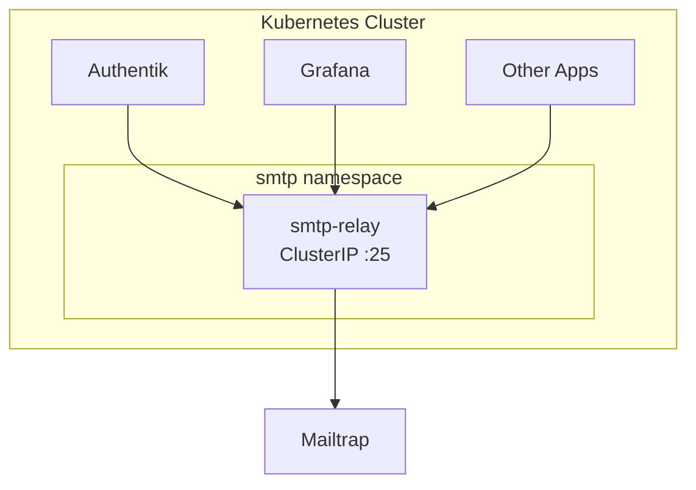

# Mail Service

This document covers SMTP relay configuration for sending emails from applications running in the cluster.

## Recommendation

**Mailtrap** is recommended for the following reasons:

- Permanent free tier (1,000 emails/month)
- Email testing/sandbox environment for development
- Production sending available on the same platform
- Simple SMTP credentials - easy to configure as a relay

**Alternative:** Use **Resend** if you prefer a modern, developer-friendly API with a generous free tier (3,000 emails/month).

## Service Comparison

| Service | Free Tier | Duration | Recommendation |
|---------|-----------|----------|----------------|
| **Mailtrap** | 1,000 emails/month | Permanent | ✅ Recommended |
| **Resend** | 3,000 emails/month | Permanent | ✅ Great alternative |
| **Brevo** | 300 emails/day | Permanent | ✅ Good option |
| Mailgun | None | Pay-as-you-go | ❌ No free tier |
| SendGrid | 100 emails/day | 60 days only | ❌ Expires |
| Postmark | 100 emails/month | 30 days only | ❌ Expires |

## Service Candidates

### Mailtrap

[Pricing](https://mailtrap.io/pricing)

- Free Tier (permanent)
- Email testing/sandbox environment
- Production sending available
- SMTP and API access

### Resend

[Pricing](https://resend.com/pricing)

- Free Tier (3,000 emails/month, permanent)
- Modern developer-friendly API
- SMTP and API access
- Good documentation

### Brevo (formerly Sendinblue)

[Pricing](https://www.brevo.com/pricing/)

- Free Tier (300 emails/day, permanent)
- Established service
- SMTP and API access

### Mailgun

[Pricing](https://www.mailgun.com/pricing/)

- No free tier (pay-as-you-go only)
- Not recommended for homelab use

### SendGrid

[Pricing](https://sendgrid.com/pricing/)

- Free Tier only valid for 60 days
- Not recommended for long-term use

### Postmark

[Pricing](https://postmarkapp.com/pricing)

- Free Tier only valid for 30 days
- Not recommended for long-term use

## Architecture

A central SMTP relay service runs inside the cluster and forwards all outgoing mail to Mailtrap. Applications connect to the internal relay without needing external credentials.



**Benefits:**

- Single point of configuration for external SMTP credentials
- Apps use simple internal DNS (`smtp-relay.smtp.svc.cluster.local:25`)
- No authentication required for internal apps
- Easy to switch upstream providers without touching app configs

## SMTP Relay Options

| Solution | Resources | Notes |
|----------|-----------|-------|
| **docker-mailserver** | ~256MB RAM | Full-featured, mature, recommended |
| Maddy | ~50MB RAM | Lightweight alternative, single binary |

## Cluster Configuration

### Namespace

```yaml
apiVersion: v1
kind: Namespace
metadata:
  name: smtp
```

### External Secret for Mailtrap

```yaml
apiVersion: external-secrets.io/v1beta1
kind: ExternalSecret
metadata:
  name: mailtrap-credentials
  namespace: smtp
spec:
  secretStoreRef:
    kind: ClusterSecretStore
    name: onepassword-connect
  target:
    name: mailtrap-credentials
  data:
    - secretKey: SMTP_USER
      remoteRef:
        key: mailtrap
        property: username
    - secretKey: SMTP_PASS
      remoteRef:
        key: mailtrap
        property: password
```

### docker-mailserver Deployment

```yaml
apiVersion: v1
kind: ConfigMap
metadata:
  name: mailserver-config
  namespace: smtp
data:
  postfix-relaymap.cf: |
    * [live.smtp.mailtrap.io]:587
  postfix-sasl-password.cf: |
    [live.smtp.mailtrap.io]:587 $(RELAY_USER):$(RELAY_PASSWORD)
---
apiVersion: apps/v1
kind: Deployment
metadata:
  name: smtp-relay
  namespace: smtp
spec:
  replicas: 1
  selector:
    matchLabels:
      app: smtp-relay
  template:
    metadata:
      labels:
        app: smtp-relay
    spec:
      containers:
        - name: mailserver
          image: ghcr.io/docker-mailserver/docker-mailserver:latest
          ports:
            - containerPort: 25
          env:
            - name: OVERRIDE_HOSTNAME
              value: "mail.cluster.local"
            - name: ENABLE_OPENDKIM
              value: "0"
            - name: ENABLE_OPENDMARC
              value: "0"
            - name: ENABLE_POLICYD_SPF
              value: "0"
            - name: ENABLE_AMAVIS
              value: "0"
            - name: ENABLE_SPAMASSASSIN
              value: "0"
            - name: ENABLE_CLAMAV
              value: "0"
            - name: ENABLE_FAIL2BAN
              value: "0"
            - name: ENABLE_POSTGREY
              value: "0"
            - name: SMTP_ONLY
              value: "1"
            - name: DEFAULT_RELAY_HOST
              value: "[live.smtp.mailtrap.io]:587"
            - name: RELAY_USER
              valueFrom:
                secretKeyRef:
                  name: mailtrap-credentials
                  key: SMTP_USER
            - name: RELAY_PASSWORD
              valueFrom:
                secretKeyRef:
                  name: mailtrap-credentials
                  key: SMTP_PASS
          volumeMounts:
            - name: config
              mountPath: /tmp/docker-mailserver
              readOnly: true
            - name: mail-data
              mountPath: /var/mail
            - name: mail-state
              mountPath: /var/mail-state
          resources:
            requests:
              memory: "128Mi"
              cpu: "50m"
            limits:
              memory: "256Mi"
              cpu: "200m"
      volumes:
        - name: config
          configMap:
            name: mailserver-config
        - name: mail-data
          emptyDir: {}
        - name: mail-state
          emptyDir: {}
---
apiVersion: v1
kind: Service
metadata:
  name: smtp-relay
  namespace: smtp
spec:
  selector:
    app: smtp-relay
  ports:
    - port: 25
      targetPort: 25
```

## Application Configuration

Applications connect to the internal relay. No credentials required.

### Authentik

```yaml
email:
  host: smtp-relay.smtp.svc.cluster.local
  port: 25
  use_tls: false
  use_ssl: false
  from: "Authentik <authentik@<your-domain>>"
```

### Grafana

```yaml
smtp:
  enabled: true
  host: smtp-relay.smtp.svc.cluster.local:25
  from_address: grafana@<your-domain>
```

### Generic Application

```yaml
env:
  - name: SMTP_HOST
    value: "smtp-relay.smtp.svc.cluster.local"
  - name: SMTP_PORT
    value: "25"
```

## Setup Steps

1. **Create Mailtrap Account** - Sign up at [mailtrap.io](https://mailtrap.io)
2. **Add and Verify Domain** - Configure DNS records (SPF, DKIM, DMARC)
3. **Store Credentials** - Add Mailtrap credentials to your secret store (1Password, Vault, etc.)
4. **Deploy SMTP Relay** - Apply the namespace, external secret, and docker-mailserver deployment
5. **Configure Applications** - Point apps to `smtp-relay.smtp.svc.cluster.local:25`


## Troubleshooting

### Test SMTP Relay

```bash
# Port-forward to the relay
kubectl port-forward -n smtp svc/smtp-relay 2525:25

# Send test email
swaks --to test@example.com --from test@<your-domain> --server localhost:2525
```

### Check Logs

```bash
kubectl logs -n smtp -l app=smtp-relay -f
```
