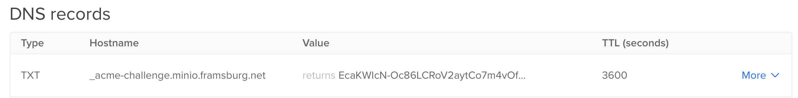

# Bare Metal Server Setup

This guide covers the setup and configuration of bare metal servers for the k3s
cluster, including MinIO storage, backup configuration, and server-specific
settings.

!!! info "Raspberry Pi Hardware Setup"
    For detailed Raspberry Pi hardware setup and configuration, see the [Raspberry Pi Hardware Guide](../hardware/raspberry-pi.md).

## Quick Start: Bootstrap New Node

The initial setup is done with Ansible. For detailed hardware-specific instructions, refer to:

- [Raspberry Pi Setup](../hardware/raspberry-pi.md) — Complete Pi hardware guide
- [Proxmox VMs](../hardware/proxmox.md) — VM configuration (if available)

### Prepare Boot Device (Raspberry PI)

- Download newest Raspberry Pi Imager
- Image Ubuntu Server
    - OS -> Other general purpose OS -> Ubuntu -> Ubuntu Server 24.04 LTS (64-bit)
    - Customisation:
        - Set username/password to `ubuntu`/`ubuntu`
        - Enable SSH with password auth

### First-Time Setup Notes

- Initial login: `ubuntu`/`ubuntu` (change password on first login)
- Update OS: `sudo apt update && sudo apt full-upgrade -y && sudo reboot`
- Update firmware (Raspberry Pi): `sudo rpi-eeprom-update -a && sudo reboot`


### Bootstrap Process

- Prerequisite: MAC address configured in DHCP server
- Remove old host keys if re-imaging: `ssh-keygen -R <oldhost> && ssh-keygen -R <ip>`
- Configure new host in ansible `hosts.yaml`
- Run ansible with `ansible-playbook add-user-ssh.yaml --limit <newhost>`
- To join cluster run `ansible-playbook playbooks/06_k3s_secure.yaml`


## Hardware Notes

### PoE HAT

See [Raspberry Pi guide](../hardware/raspberry-pi.md#poe-hat-fan-control) for fan control configuration.

### Power Supply / UPS

For UPS integration: https://github.com/dzomaya/NUTandRpi

### Status Indicators

BlinkStick Nano for visual status: https://www.blinkstick.com/products/blinkstick-nano

## Longhorn Storage Disks

For detailed Longhorn disk setup on Raspberry Pi workers, see the [Raspberry Pi guide](../hardware/raspberry-pi.md#external-nvme-drive-setup).

**Troubleshooting:** https://www.ekervhen.xyz/posts/2021-02/troubleshooting-longhorn-and-dns-networking/


## MinIO Setup

MinIO is used as an S3-compatible storage backend for backups (etcd snapshots, Longhorn volumes).

!!! warning "TLS/Certificate Requirements"
    MinIO should be set up with a proper domain and valid certificate. Many systems do not support insecure connections
    or custom certificates.

### Installation

Install MinIO using the official installer. See [MinIO Documentation](https://min.io/docs/minio/linux/operations/install-deploy-manage/deploy-minio-single-node-single-drive.html).

### TLS Certificates

#### Option 1: Certbot (Let's Encrypt)

You can use an HTTP or DNS challenge. DNS challenge is described on [DigitalOcean](https://www.digitalocean.com/community/tutorials/how-to-acquire-a-let-s-encrypt-certificate-using-dns-validation-with-acme-dns-certbot-on-ubuntu-18-04).

```bash
certbot certonly \
  --config-dir config \
  --work-dir workdir \
  --logs-dir logs \
  --manual \
  --preferred-challenges dns \
  --debug-challenges \
  -d minio.example.com
```

During execution, certbot requires you to add a specific DNS TXT record to your domain:



#### Option 2: OPNsense ACME Client

OPNsense has an ACME service plugin for automatic certificate generation.

**Key Detail:** MinIO uses the full chain (`cert + ca`) for the public certificate, not just the cert file.
See [MinIO TLS Documentation][4].

**OPNsense ACME Automation Config:**

| Field                  | Value                            |
|------------------------|----------------------------------|
| Name                   | Upload Minio Certificate         |
| Run Command            | Upload certificate via SFTP      |
| SFTP Host              | minio.server                     |
| SFTP Port              | 22                               |
| Remote Path            | `/home/minio-user/.minio/certs`  |
| Naming "key.pem"       | private.key                      |
| Naming "fullchain.pem" | public.crt                       |

### Prometheus Monitoring

MinIO requires environment variables for Prometheus integration:

```shell
$ export MINIO_PROMETHEUS_URL=https://prometheus.example.com
$ export MINIO_PROMETHEUS_JOB_ID=minio-job
$ export MINIO_PROMETHEUS_AUTH_TYPE=public  # If not using JWT auth
```

Add these to the MinIO service configuration or environment file.


### MinIO Bucket for K3S Backups

Create a bucket and user for etcd snapshot backups:


**Create bucket structure**

```bash
$ mc mb myminio/k3s
$ mc mb myminio/k3s/etcd-snapshot
```

**Create user**

```bash
$ mc admin user add myminio k3s k3sk3sk3s
```

**Create policy**

```bash
cat > /tmp/etcd-backups-policy.json <<EOF
{
  "Version": "2012-10-17",
      "Statement": [
    {
      "Action": [
        "s3:PutBucketPolicy",
        "s3:GetBucketPolicy",
        "s3:DeleteBucketPolicy",
        "s3:ListAllMyBuckets",
        "s3:ListBucket"
      ],
      "Effect": "Allow",
      "Resource": [
        "arn:aws:s3:::k3s"
      ],
      "Sid": ""
    },
    {
      "Action": [
        "s3:AbortMultipartUpload",
        "s3:DeleteObject",
        "s3:GetObject",
        "s3:ListMultipartUploadParts",
        "s3:PutObject"
      ],
      "Effect": "Allow",
      "Resource": [
        "arn:aws:s3:::k3s/*"
      ],
      "Sid": ""
    }
  ]
}
EOF
```

**Apply policy**

```bash
$ mc admin policy create myminio etcd-backups-policy /tmp/etcd-backups-policy.json
$ mc admin policy attach myminio etcd-backups-policy --user k3s
```


## K3S Etcd Backup Configuration

Configure k3s to automatically back up etcd snapshots to MinIO.

### Ansible Configuration

Add to `k3s-server.service` template:

```ini
[Service]
ExecStart={{ k3s_binary_path }}/k3s server \
    # ... other flags ...

    --etcd-s3 \
    --etcd-snapshot-schedule-cron='{{ backup_schedule_cron }}' \
    --etcd-s3-endpoint='{{ backup_s3_endpoint }}' \
    --etcd-s3-endpoint-ca='{{ systemd_dir }}/k3s-server.service.crt' \
    --etcd-s3-bucket='{{ backup_s3_bucket }}' \
    --etcd-s3-folder='{{ backup_s3_folder }}' \
    --etcd-s3-access-key='{{ backup_s3_access_key }}' \
    --etcd-s3-secret-key='{{ backup_s3_secret_key }}' \

```

### Ansible Variables

Edit vault file with `ansible-vault edit group_vars/all.yaml` and add the access and secret key for the new bucket:

```yaml title=group_vars/all.yaml
backup_s3_access_key: k3s
backup_s3_secret_key: k3sk3sk3s
```

In `hosts.yaml` or group vars:

```yaml title=hosts.yaml
backup_schedule_cron: '0 */6 * * *'  # Every 6 hours
backup_s3_bucket: k3s
backup_s3_endpoint: minio.framsburg.ch:9000
```

In case the MinIO server uses a self-signed or custom CA certificate, add the CA cert to the k3s server nodes by adding
`backup_s3_endpoint_ca`: to the variables above:

```yaml title=hosts.yaml
backup_s3_endpoint_ca: |
  -----BEGIN CERTIFICATE-----
  MIIDgTCCAmmgAwIBAgIJAJ85e+K5ngFRMA0GCSqGSIb3DQEBCwUAMGsxCzAJBgNV
```


## Rolling Updates

The initial Ansible playbook is optimized for cluster initialization (setup/restore), which requires this order:

1. First control plane node (initializes or restores etcd)
2. Other control plane nodes (sync to first)
3. All worker nodes

This is efficient for setup but would cause outages on a live cluster. For production updates, you need a sequential
rolling update that properly drains nodes.

### Update K3S Version

Update the version in `hosts.yaml` or manifest file.

Use playbook `07_k3s_update.yml` and update control plane nodes **one at a time**:

```bash
# Update each server individually
ansible-playbook playbooks/07_k3s_update.yml --limit k3s-server01
# Wait for cluster to stabilize
ansible-playbook playbooks/07_k3s_update.yml --limit k3s-server02
# Wait for cluster to stabilize
ansible-playbook playbooks/07_k3s_update.yml --limit k3s-server03
```

!!! warning "Important"
    Wait for Longhorn and other storage systems to recover between reboots. They need time to stabilize or may block
    shutdowns and risk data loss.

### Replace Existing Host

If replacing a node:

1. Remove node from cluster: `kubectl delete node <nodename>`
2. **Verify node is removed from etcd member list** 
   ```bash
   etcdctl member list
   ```
   _No new node can join if the cluster is unhealthy due to missing members!_
3. Add new host to Ansible inventory
4. Run bootstrap playbook for new node:
   ```bash
   ansible-playbook add-user-ssh.yaml --limit <newhost>
   ansible-playbook playbooks/06_k3s_secure.yaml # (1) !
   ```
   1. Careful: If you use limit here without any other master node, you will initialize a new cluster instead of joining!


## Hardware-Specific Configuration

### Lenovo Tiny Servers — E1000 NIC Issues

Some tiny servers (like Lenovo ThinkCentre) may have network card issues with hardware offloading. If the network
adapter hangs:

```bash
# Disable offloading features
ethtool -K <ADAPTER> gso off gro off tso off
```

Add this as a startup command in `/etc/network/if-up.d/` to persist across reboots.

### Proxmox — Adding New Network Card

When adding a new network card to replace an old one:

1. **Check for missing kernel modules:**
   ```bash
   dmesg | grep -i ethernet
   # Should return no error messages
   ```

2. **List all interfaces:**
   ```bash
   ip link show
   # Note the name of the new interface (e.g., enp3s0)
   ```

3. **Update `/etc/network/interfaces`:**

   **Before:**
   ```
   auto lo
   iface lo inet loopback

   iface eno1 inet manual
           gso-offload off
           tso-offload off

   auto vmbr0
   iface vmbr0 inet static
           address 192.168.42.110/24
           gateway 192.168.42.1
           bridge-ports eno1
           bridge-stp off
           bridge-fd 0
           bridge-vlan-aware yes
           bridge-vids 2-4094
   ```

   **After:**
   ```
   auto lo
   iface lo inet loopback

   iface enp3s0 inet manual

   auto vmbr0
   iface vmbr0 inet static
           address 192.168.42.111/24
           gateway 192.168.42.1
           bridge-ports enp3s0
           bridge-stp off
           bridge-fd 0
           bridge-vlan-aware yes
           bridge-vids 2-4094
   ```

4. **Restart networking:**
   ```bash
   systemctl restart networking.service
   ```


## Hardware Vendors & Resources

Useful vendors for homelab hardware:

### Rack Hardware
- [MK1 Manufacturing](https://www.mk1manufacturing.com/cart.php?m=view) — Custom rack solutions
- [RackNex](https://racknex.com/shop/lenovo/) - Lenovo servers
- [Uctronics](https://www.uctronics.com/raspberry-pi.html) - Raspberry Pi accessories

### Servers & Components
- [45Homelab](https://store.45homelab.com/configure/hl15) - HL15 storage server
- [ServeTheHome](https://www.servethehome.com/introducing-project-tinyminimicro-home-lab-revolution/) — Project TinyMiniMicro
- [PCHc.ch](https://www.pchc.ch/en/Divers/spare-parts/Lenovo-CARDPOP-BLD-Tiny8-BTB-LAN-card----5C50W00908.html) - Lenovo Tiny LAN cards

### Used Hardware (eBay Examples)
- [ServerSchmiede](https://www.serverschmiede.com/) — TrueNAS and Supermicro configurators
- [Serverando](https://serverando.de/Server/) — Various servers

Or search for "Lenovo ThinkCentre Tiny", "HP EliteDesk Mini", or "Dell OptiPlex Micro" for compact, power-efficient servers like:
- https://www.ebay.de/itm/404433125454?itmmeta=01J2635VSAH35D01S3P83AEHSX&hash=item5e2a17c04e:g:eN8AAOSwNFxktdsz&var=674539469591
- https://www.ebay.de/itm/305247609020?itmmeta=01J262NDCBCZ5V7WGW29NDQGZC&hash=item47122ce0bc:g:fFcAAOSw95plqVp0&itmprp=enc%3AAQAJAAAA4P%2BHsi8ZJxxkeeuXEbknuuEvnrzmVSyLnf8JsUZ6M3ubQM06d5Ztt8bkEqeBHOEQIseuaFiwu%2BYeZWs2ohLL9pgM8QdmI7XsxgytIKQ5lFwdND6qDTMi5ODfbropBH5gVAVKfJ6hmSx1MuvFA2O1cmz8DAxXaETqWV33zz1phg3vNu9c7P2qmopNvlD28mJB0UlnxGhm8I3NHdEp8FUPw4FB0Kit63lUxxvDAiRGQ5IR3LQCBl7xmJHFnhIkaDfDnBCC2rsIXj903lnHDSGRuvXc4R4DF%2FXQQa5PekGctP7R%7Ctkp%3ABFBMotbVwpFk
- https://www.ebay.de/itm/404433125454?chn=ps&_ul=DE&var=674539291378&norover=1&mkevt=1&mkrid=707-166974-037691-2&mkcid=2&mkscid=101&itemid=674539502517_404433125454&targetid=2279743046334&device=c&mktype=pla&googleloc=1002964&poi=&campaignid=20743725838&mkgroupid=156953869822&rlsatarget=pla-2279743046334&abcId=9330607&merchantid=5361935233&geoid=1002964&gad_source=1&gbraid=0AAAAAD_G4xa4G7JEe2Z80T4KhK0Ii0ERO&gclid=Cj0KCQjw-ai0BhDPARIsAB6hmP6Go03PZEXz5yMqYFizH6-J0wiekFwj-PhXREKvgglAMvHLL7MFWVsaAk52EALw_wcB

---

## References

[1]: https://min.io/docs/minio/linux/integrations/generate-lets-encrypt-certificate-using-certbot-for-minio.html
[2]: https://www.digitalocean.com/community/tutorials/how-to-acquire-a-let-s-encrypt-certificate-using-dns-validation-with-acme-dns-certbot-on-ubuntu-18-04
[3]: https://www.jeffgeerling.com/blog/2021/taking-control-pi-poe-hats-overly-aggressive-fan
[4]: https://min.io/docs/minio/linux/integrations/generate-lets-encrypt-certificate-using-certbot-for-minio.html#step-4-set-up-ssl-on-minio-server-with-the-certificates

--8<-- "includes/abbreviations.md"
