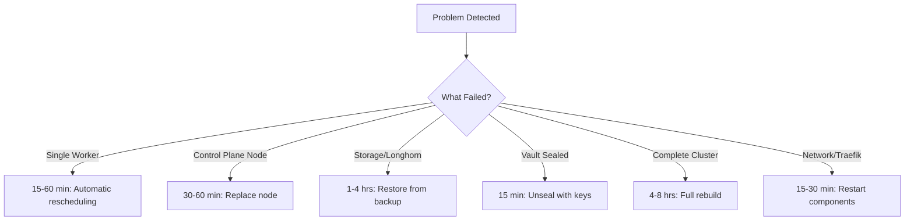

# Disaster Recovery

This guide covers how to recover from various disaster scenarios, from single component failures to complete cluster loss.

!!! danger "Before Disaster Strikes - Critical Preparation"
    Ensure you have:
    
    - [ ] Break-glass kubeconfig saved externally (from `/etc/rancher/k3s/k3s.yaml`)
    - [ ] Vault unseal keys stored securely outside the cluster
    - [ ] Git repository backed up (GitHub provides this)
    - [ ] Longhorn backups enabled to TrueNAS
    - [ ] PostgreSQL backups configured
    - [ ] Ansible inventory and vault passwords backed up

## Quick Recovery Decision Tree



## Recovery Scenarios

### Scenario 1: Single Worker Node Failure

**Impact**: Minimal - workloads reschedule automatically

**Recovery Steps**:

1. **Verify node is down**:
   ```bash
   kubectl get nodes
   # Node shows NotReady or missing
   ```

2. **Check pod redistribution**:
   ```bash
   kubectl get pods -A -o wide | grep <failed-node>
   # Should see pods rescheduling to other nodes
   ```

3. **Fix or replace node**:
   - If hardware failure: Replace hardware
   - If software issue: SSH to node and investigate
   - If unrecoverable: Remove node and add new one

4. **Remove dead node** (if needed):
   ```bash
   kubectl drain <node-name> --ignore-daemonsets --delete-emptydir-data
   kubectl delete node <node-name>
   ```

5. **Add replacement node**:
   ```bash
   cd ansible-directory
   ansible-playbook add-user-ssh.yaml --limit <new-node>
   ansible-playbook playbooks/06_k3s_secure.yaml --limit <new-node>
   ```

**Recovery Time**: 15-60 minutes

### Scenario 2: Complete Cluster Loss

**Impact**: Catastrophic - everything down

!!! warning "This is why we use GitOps"
    With GitOps, rebuilding is straightforward because all configuration is in Git.

#### Phase 1: Rebuild Cluster (2-4 hours)

1. **Rebuild nodes with Ansible**:
   ```bash
   cd ansible-directory
   ansible-playbook site.yml
   ansible-playbook playbooks/06_k3s_secure.yaml
   ```

2. **Verify cluster is up**:
   ```bash
   kubectl get nodes
   # All nodes should be Ready
   ```

#### Phase 2: Bootstrap ArgoCD (30 minutes)

3. **Install ArgoCD manually** (the only manual step):
   ```bash
   kubectl create namespace argocd-system
   helm repo add argo https://argoproj.github.io/argo-helm
   helm install argocd argo/argo-cd -n argocd-system
   ```

4. **Deploy root ApplicationSet**:
   ```bash
   kubectl apply -f apps-root-config/bootstrap/
   ```

5. **Watch ArgoCD sync everything**:
   ```bash
   kubectl get applications -n argocd-system --watch
   ```

#### Phase 3: Restore Data (1-4 hours)

6. **Restore Vault**:
   - Restore Longhorn volume from backup
   - Unseal Vault with saved keys
   - Or manually re-enter secrets

7. **Restore Longhorn volumes**:
   - Longhorn UI → Backup tab
   - Restore each critical volume
   - Update PVCs to use restored volumes

8. **Restore PostgreSQL databases**:
   ```bash
   # CNPG will restore from backup automatically if configured
   ```

**Total Recovery Time**: 4-8 hours

### Scenario 3: Vault Sealed/Lost

**Impact**: Severe - secrets unavailable, pods using secrets fail

**Recovery Steps**:

1. **Check Vault status**:
   ```bash
   kubectl exec -it vault-0 -n vault -- vault status
   # If sealed: true, needs unsealing
   ```

2. **Unseal Vault** (you need unseal keys):
   ```bash
   kubectl exec -it vault-0 -n vault -- vault operator unseal <key1>
   kubectl exec -it vault-0 -n vault -- vault operator unseal <key2>
   kubectl exec -it vault-0 -n vault -- vault operator unseal <key3>
   # Need threshold number of keys (typically 3 of 5)
   ```

3. **If Vault data lost completely**:
   - **With backup**: Restore Vault data from backup
   - **Without backup**: Re-initialize Vault and re-enter all secrets (painful)

4. **Restart pods using secrets**:
   ```bash
   # External Secrets will re-sync
   kubectl rollout restart deployment <name> -n <namespace>
   ```

**Recovery Time**: 15 minutes (unseal), 2-8 hours (complete rebuild)

### Scenario 4: Storage Loss (Longhorn)

**Impact**: Severe - all persistent data lost if no backups

**Recovery Steps**:

1. **Check Longhorn status**:
   ```bash
   kubectl get pods -n longhorn-system
   ```

2. **If volumes corrupted/lost**:
   - **With Backups**: Restore from backup
   - **Without Backups**: Data is lost - rebuild from scratch

3. **Restore from Longhorn backup**:
   ```bash
   # Via Longhorn UI:
   # 1. Go to Backup tab
   # 2. Find backup for lost volume
   # 3. Click "Restore"
   # 4. Create new volume from backup
   ```

**Recovery Time**: 1-4 hours (depending on data size)

### Scenario 5: Certificate Manager Down

**Impact**: Moderate - existing certificates work, but renewals fail

**Recovery Steps**:

1. **Check cert-manager pods**:
   ```bash
   kubectl get pods -n cert-manager
   ```

2. **Restart cert-manager**:
   ```bash
   kubectl rollout restart deployment cert-manager -n cert-manager
   ```

3. **Force certificate renewal**:
   ```bash
   kubectl delete certificaterequest -A --all
   # cert-manager will recreate them
   ```

**Recovery Time**: 15 minutes

### Scenario 6: Network Failure (Traefik/MetalLB Down)

**Impact**: Severe - can't access any services externally

**Recovery Steps**:

1. **Check MetalLB**:
   ```bash
   kubectl get pods -n metallb-system
   kubectl logs -n metallb-system -l app=metallb
   ```

2. **Check Traefik**:
   ```bash
   kubectl get pods -n traefik
   kubectl logs -n traefik -l app.kubernetes.io/name=traefik
   ```

3. **Restart components**:
   ```bash
   kubectl rollout restart deployment controller -n metallb-system
   kubectl rollout restart daemonset speaker -n metallb-system
   kubectl rollout restart deployment traefik -n traefik
   ```

**Recovery Time**: 15-30 minutes

## Backup Verification

### Test Backups Regularly

**Monthly Task**:

1. **Verify Longhorn backups**:
   - Longhorn UI → Backup tab
   - Check last backup timestamp
   - Try restoring a test volume

2. **Verify PostgreSQL backups**:
   ```bash
   kubectl get backup -A
   ```

3. **Test disaster recovery procedure** (in test cluster):
   - Destroy test cluster
   - Rebuild from scratch
   - Restore data
   - Document any issues

## Emergency Contacts

**External Dependencies**:

- **Domain/DNS**: CloudFlare (has separate login)
- **Git Repository**: GitHub (has separate login)
- **Backup Storage**: TrueNAS (admin credentials)

**Critical Credentials** (store in password manager):

- Break-glass kubeconfig
- Vault unseal keys
- Vault root token
- TrueNAS admin password
- Ansible vault password
- GitHub SSH keys
- CloudFlare API token

## Post-Recovery Tasks

After recovering from a disaster:

1. **Update documentation**: What worked? What didn't?
2. **Review root cause**: Why did the failure occur?
3. **Improve automation**: Can this be prevented or recovered faster?
4. **Test recovery process**: Ensure it works next time
5. **Update backup strategy**: Were backups sufficient?

## Prevention

**Best Practices**:

- ✅ Regular backups (automated)
- ✅ Test restore procedures
- ✅ Monitor backup success/failures
- ✅ Keep credentials secure but accessible
- ✅ Document everything (like this!)
- ✅ Use GitOps (so configuration is always in Git)
- ✅ High availability for critical components
- ✅ Regular maintenance and updates

--8<-- "includes/abbreviations.md"
